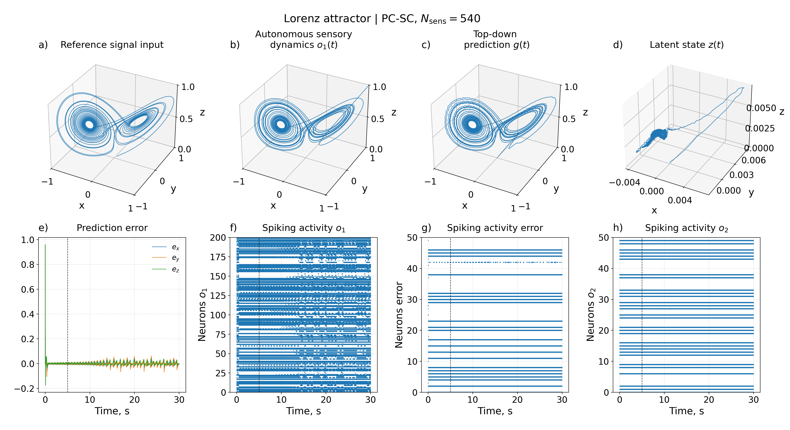

# Predictive-Coding-Inspired Reconstruction in Spiking Neural Networks

This repository contains reproducible Python experiments for reconstructing and
synchronizing low-dimensional dynamical signals with predictive-coding-inspired
spiking neural networks (SNNs). The code compares two ways of communicating a
prediction error:

- **PC-EC (error-current)**: the continuous error \(e = o_1 - g\) drives the
  latent population directly.
- **PC-SC (spiking-error coding)**: a dedicated spiking error population encodes
  and decodes the error before it drives the latent population.

The experiments use leaky integrate-and-fire (LIF) populations and the Neural
Engineering Framework (NEF) approach. They evaluate reconstruction quality,
synchronization, runtime, and memory use on a chaotic Lorenz system and a 2-D
harmonic oscillator.



## Repository contents

| File | Purpose |
| --- | --- |
| `PC-EC_PC-SC_lorenz.py` | Main single-run PC-EC vs. PC-SC sweep configured for the Lorenz attractor. |
| `PC-EC_PC-SC_osc.py` | Main single-run PC-EC vs. PC-SC sweep configured for the harmonic oscillator. |
| `compare_bio_nebio_full.py` | Repeated PC-SC vs. PC-EC experiments, aggregation over random tests, and 4×2 metric plots. |
| `ablation_lorenz.py` | One-at-a-time hyperparameter sensitivity analysis. |
| `ablation_osc.py` | Oscillator version of the hyperparameter sensitivity analysis. |
| `compare_graph.py` | Creates publication-style 4×2 comparison figures from an Excel results table. |
| `figs/` | Example figures produced by the experiments. |

## Model overview

The reference trajectory is first represented by an autonomous sensory
population, denoted \(o_1\). During a cue interval, the reference signal forces
the sensory dynamics; afterwards the population evolves autonomously. A
top-down prediction \(g\) is reconstructed from a latent state \(z\), and the
network minimizes the discrepancy between \(o_1\) and \(g\).

The central difference between architectures is the error pathway:

```text
PC-EC:  o1 ──► e = o1 − g ──► latent state z ──► prediction g

PC-SC:  o1 ──► e = o1 − g ──► spiking error population ──► z ──► g
```

PC-SC therefore includes a real error-neuron raster and learned static decoders
for the error population; PC-EC does not create an artificial error-spike
population.

## Requirements

- Python 3.9 or newer
- `numpy`
- `pandas`
- `matplotlib`
- `psutil` (optional; enables RSS memory measurements)
- `openpyxl` (needed for Excel input/output)

Install the dependencies in a virtual environment:

```bash
python -m venv .venv
source .venv/bin/activate              # Windows: .venv\Scripts\activate
python -m pip install numpy pandas matplotlib psutil openpyxl
```

## Quick start

Run commands from the repository root:

```bash
cd Predictive-Coding-Inspired-Reconstruction-in-SNN

# Lorenz attractor experiment
python PC-EC_PC-SC_lorenz.py

# 2-D harmonic oscillator experiment
python PC-EC_PC-SC_osc.py
```

Each main script defines a `Config` dataclass near its beginning. Before a
large run, adjust the following fields as appropriate:

```python
signal_names = ("lorenz",)       # or ("oscillator",)
n_sens_values = (50, 100, 200)  # sensory-population sizes to compare
T = 30.0                         # simulation duration in seconds
dt = 0.001                       # simulation time step
out_dir = "results_my_run"       # output directory
```

The checked-in defaults run one representative condition, not a full parameter
sweep. Increase `n_sens_values` only after confirming that the selected setup
runs successfully on your machine.

## Experiments and outputs

### PC-EC vs. PC-SC

`PC-EC_PC-SC_lorenz.py` and `PC-EC_PC-SC_osc.py` train an offline recurrent
decoder for the sensory population and then simulate both architectures at each
chosen sensory-population size. Results are written to `Config.out_dir`:

- `config.txt` — exact experiment settings;
- `summary_metrics.csv` — metrics for every architecture and population size;
- `summary_metrics_partial.csv` — checkpoint table updated during a sweep;
- `figures/overview_*.png` — reference, autonomous trajectory, prediction,
  latent state, error, and spike rasters;
- `figures/components_*.png` — component-wise reconstruction plots;
- `figures/comparison_*.png` — metric-vs-population-size summaries.

The reported quality metrics include RMSE for `reference` vs. \(o_1\) and
\(o_1\) vs. \(g\), amplitude and frequency correlations, phase-locking value
(PLV), and phase difference. Runtime and Python/RSS peak-memory measurements
are also recorded.

### Repeated comparison

For estimates with variability across random initializations, run:

```bash
python compare_bio_nebio_full.py
```

Set `n_tests`, `n_sens_values`, `signal_names`, and `out_dir` in its `Config`
before execution. The script saves raw and mean ± standard-deviation tables in
both CSV and XLSX formats, as well as a 4×2 summary figure for each signal.

### Hyperparameter ablation

The ablation scripts sweep one hyperparameter at a time across learning rate,
time constants, ridge regularization, and cue duration. They deliberately reuse
functions from a main simulation script. Before running an ablation, update its
`SIM_MODULE` constant (the checked-in default does not match a file in this
repository) to the desired main module:

```python
SIM_MODULE = "PC-EC_PC-SC_lorenz"
# or
SIM_MODULE = "PC-EC_PC-SC_osc"
```

Then run the relevant file:

```bash
python ablation_lorenz.py
# or
python ablation_osc.py
```

Set `QUICK_TEST = True` to use the reduced ablation grid. Full ablations are
computationally intensive because they repeat simulations over parameter values,
seeds, and both architectures. They produce `ablation_raw.csv`,
`ablation_aggregated.csv`, and RMSE-grid figures.

### Publication-style comparison plots

`compare_graph.py` converts an existing Excel results table into PNG, PDF, and
SVG 4×2 figures. Update `XLSX_PATH` at the top of the script to point to your
`summary_metrics_mean_std.xlsx` file, then run:

```bash
python compare_graph.py
```

## Reproducing the included figures

The `figs/` directory includes example outputs for both reference dynamics,
component reconstructions, and hyperparameter ablations. Figure appearance can
be controlled through `dpi`, `show_plots`, and the plotting options in each
script. For headless systems, set `MPLBACKEND=Agg` before running a script if
your environment does not already select a non-interactive Matplotlib backend.

## License

This project is distributed under the [GNU Affero General Public License v3.0](LICENSE).
